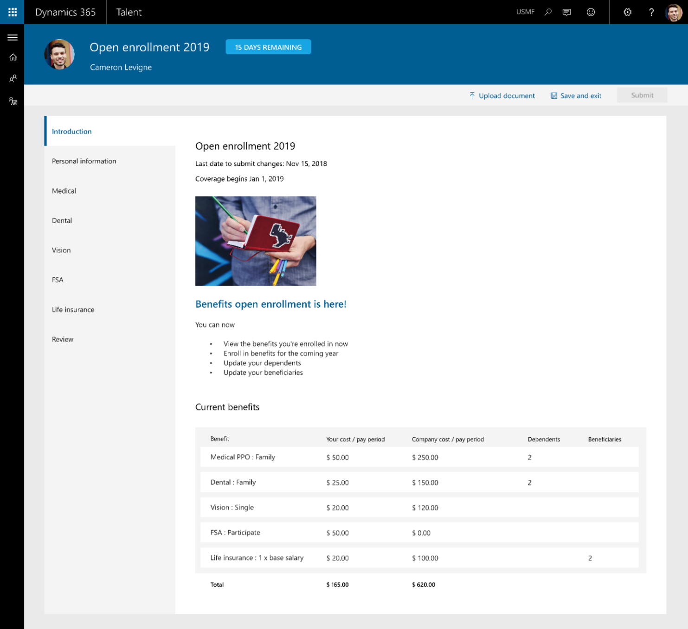

---

title: Benefits enhancements
description: -   **Benefits open enrollment**.
author: MargoC
manager: AnnBe
ms.date: 4/18/2018
ms.topic: article
ms.prod: 
ms.service: business-applications
ms.technology: 
ms.author: margoc
audience: Admin

---
#  Benefits enhancements

[!include[banner](../../../includes/banner.md)]

-   **Benefits open enrollment**. Benefits open enrollment provides employees
    with a easy-to-follow, self-service experience for selecting their benefits.
    Human resource administrators can configure their organization’s benefits
    open enrollment process. They can also design the employee enrollment
    experience using a guided solution. Employee benefit enrollment elections
    can then be exported and sent to benefit providers.

-   **Life event changes (coming after April).** This feature streamlines the
    processing for employees to initiate qualified life event changes. Human
    resource administrators can also use it to easily configure rules and a
    workflow to track qualified life event changes.

<!-- Talent_Benefits Enhancements_A.png -->

Benefits open enrollment
