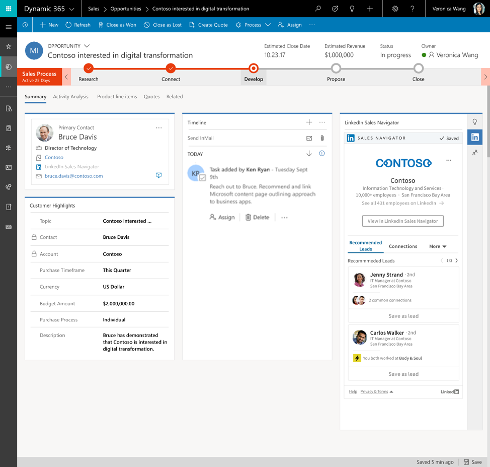

---

title: LinkedIn Sales Navigator (SNAP) controls on forms
description: With LinkedIn Sales Navigator integration, business analysts and system administrators can add customizable form controls that deliver insights to help salespeople build connections as they work deals.
author: MargoC
manager: AnnBe
ms.date: 4/18/2018
ms.topic: article
ms.prod: 
ms.service: business-applications
ms.technology: 
ms.author: margoc
audience: Admin

---
#  LinkedIn Sales Navigator (SNAP) controls on forms

[!include[banner](../../../includes/banner.md)]

With LinkedIn Sales Navigator integration, business analysts and system
administrators can add customizable form controls that deliver insights to help
salespeople build connections as they work deals. The controls provide a full
view into Sales Navigator member or company profiles, or focused views into lead
icebreakers, mutual connections, and related leads, as well as account
connections, recommended leads, and news.

<!-- Picture 10 -->

LinkedIn Sales Navigator integration controls
