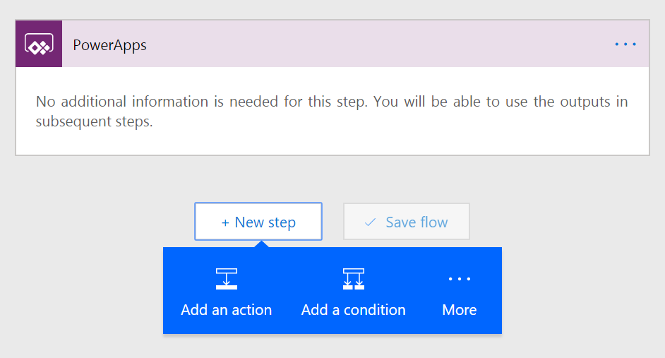

---

title: Step One
description: 
author: MargoC
manager: AnnBe
ms.date: 4/16/2018
ms.topic: article
ms.prod: 
ms.service: business-applications
ms.technology: 
ms.author: margoc
audience: Admin

---
#### Step One

To set up a flow that calls data from PowerApps, first start your flow with the
PowerApps trigger.

<!-- Picture 40 -->

PowerApps trigger

Next, add whatever actions you want to run when your flow is called. Inside
these actions you can use the **Ask in PowerApps** option to collect additional
parameters from the PowerApp.
