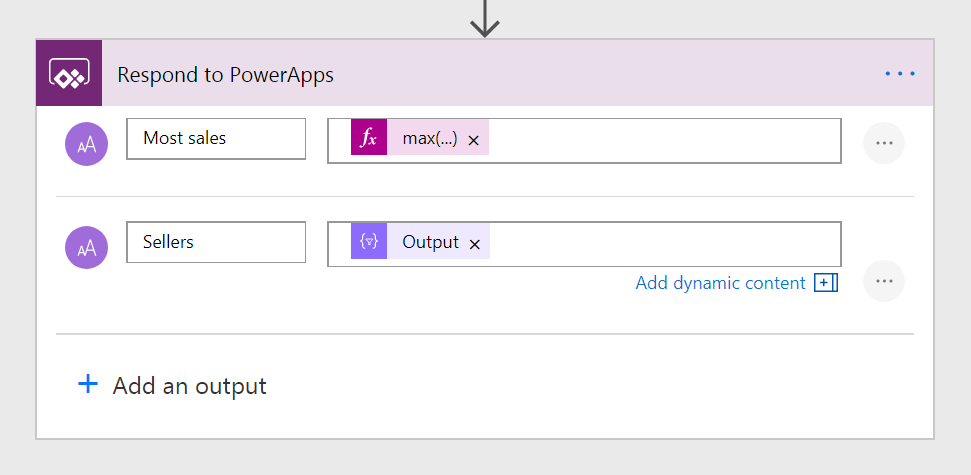

---

title: Step Two
description: 
author: MargoC
manager: AnnBe
ms.date: 4/16/2018
ms.topic: article
ms.prod: 
ms.service: business-applications
ms.technology: 
ms.author: margoc
audience: Admin

---
#### Step Two

After you have built your flow and collected the data you need, add
the **Respond to PowerApps** action. In this action, define the output fields
you want to provide to PowerApps. Name each field, and select Add Dynamic
Content to pass in data from the actions in the flow.

<!-- Picture 41 -->

Response action
