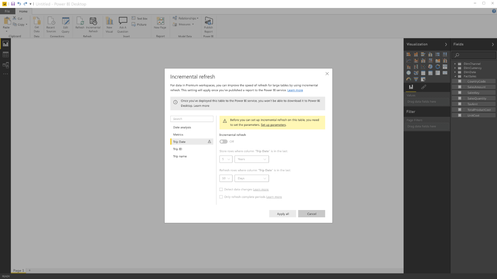

---

title: Incremental refresh policies
description: 
author: MargoC
manager: AnnBe
ms.date: 4/16/2018
ms.topic: article
ms.prod: 
ms.service: business-applications
ms.technology: 
ms.author: margoc
audience: Admin

---
### Incremental refresh policies

You can design refresh policies in Power BI Desktop to determine how data is
incrementally loaded during a scheduled refresh. Because of this, you experience
larger scale and improved performance when you refresh data, because only the
new data needs to be refreshed.

<!-- picture -->

Design form for refresh policies
