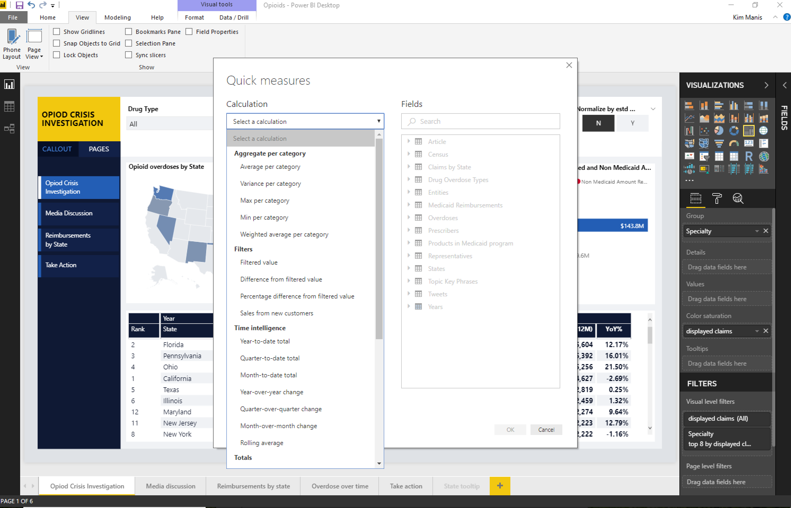

---

title: Quick measures
description: 
author: MargoC
manager: AnnBe
ms.date: 4/16/2018
ms.topic: article
ms.prod: 
ms.service: business-applications
ms.technology: 
ms.author: margoc
audience: Admin

---
### Quick measures

The quick measures feature is generally available, and it no longer requires the
feature to be turned on from the **Preview** tab in the **Options** dialog box.
Additionally, the date hierarchy in Power BI is no longer required for time
intelligence quick measures. Instead, you can use the **Date** field from your
own date table.

Quick measures for Power BI Desktop
