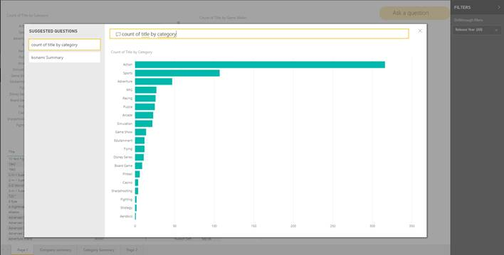

---

title: User experiences for Q&A in reports
description: 
author: MargoC
manager: AnnBe
ms.date: 4/16/2018
ms.topic: article
ms.prod: 
ms.service: business-applications
ms.technology: 
ms.author: margoc
audience: Admin

---
### User experiences for Q&A in reports

Report authors can enable Q&A experiences for report consumers with suggested
questions to start from. These same experiences are surfaced in the Power BI
Service, Power BI Embedded, and Cortana, so users can perform explorations with
a preferred client.

<!-- Picture 2 -->

Example of Power BI Desktop Q&A

