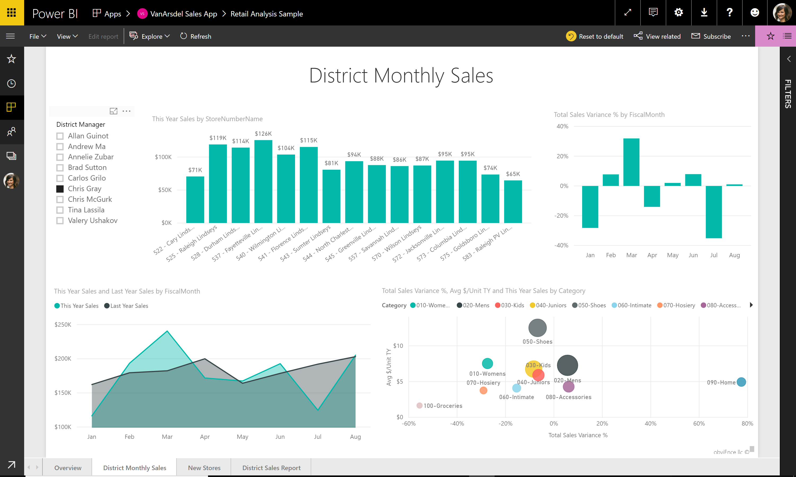

---

title: Persistent filters
description: 
author: MargoC
manager: AnnBe
ms.date: 4/16/2018
ms.topic: article
ms.prod: 
ms.service: business-applications
ms.technology: 
ms.author: margoc
audience: Admin

---
### Persistent filters

Power BI persistent filters save users’ slicer and filter values, and
automatically applies them when users return to view the reports. Users can
reset filters back to the default setting.

Filters on a report

