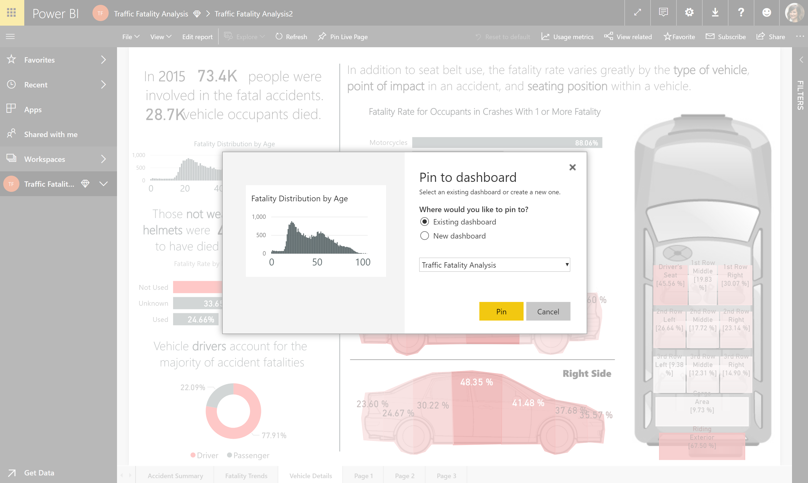

---

title: Pin from apps to dashboard
description: 
author: MargoC
manager: AnnBe
ms.date: 4/16/2018
ms.topic: article
ms.prod: 
ms.service: business-applications
ms.technology: 
ms.author: margoc
audience: Admin

---
### Pin from apps to dashboard

You can use dashboards to combine information from other shared dashboards,
reports, or apps to create a 360-degree view. Now you can pin from dashboards
that are distributed to you through apps, as well as when you’re the owner of
the dashboard or report that you’re pinning from. You can create a personal
dashboard or bring together and distribute information.

Pin apps to a dashboard

