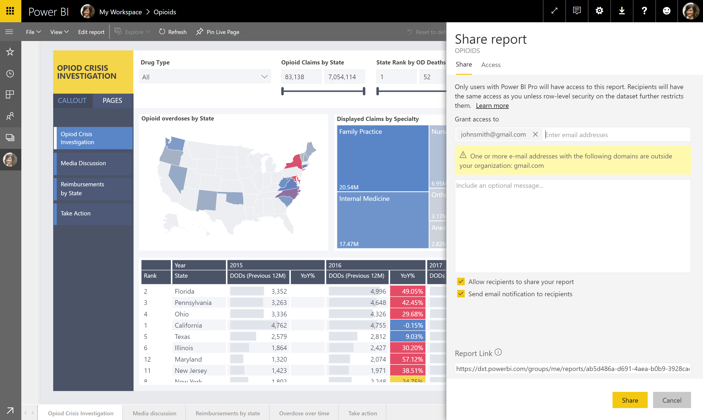

---

title: Sharing content with consumer accounts
description: 
author: MargoC
manager: AnnBe
ms.date: 4/16/2018
ms.topic: article
ms.prod: 
ms.service: business-applications
ms.technology: 
ms.author: margoc
audience: Admin

---
### Sharing content with consumer accounts

You can share content with other users who have email addresses from consumer
email services or telecommunications providers. Users can view Power BI content,
but not author it. You can use additional admin controls through Azure Active
Directory to restrict or control consumer sharing behavior, depending on
organizational security policies.

Share a report

