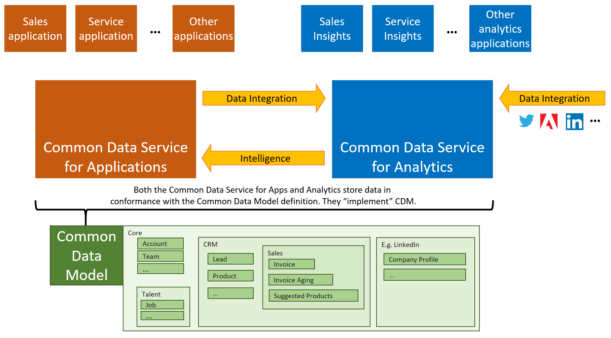
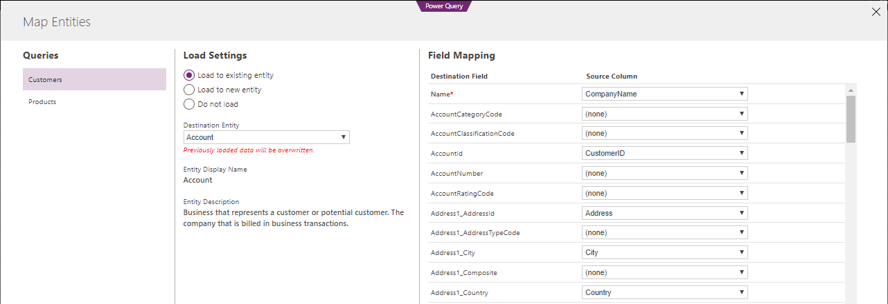

---

title: Common Data Model and Data Integration
description: 
author: MargoC
manager: AnnBe
ms.date: 4/16/2018
ms.topic: article
ms.prod: 
ms.service: business-applications
ms.technology: 
ms.author: margoc
audience: Admin

---
### Common Data Model and Data Integration

The Common Data Model is an open-source definition of standard entities that
represent commonly used concepts and activities across a variety of business and
application domains. The Common Data Model offers well-defined, modular, and
extensible business entities such as Account, Business Unit, Case, Contact,
Lead, Opportunity, and Product. It also offers interactions and relationships
between vendors, workers, and customers, such as activities and service level
agreements.

The Common Data Service for Apps and the Common Data Service for Analytics from
Microsoft implement the Common Data Model. These services hold data that
conforms to the Common Data Model definition. By building on top of these
services, packaged applications and analytical solutions can work with
well-defined entity shapes and share data, regardless of where data originally
comes from or where it’s mastered. Custom line-of-business apps and analytical
solutions can take advantage of the same entities for data sharing.

Microsoft and our partners are committed to building applications on top of the
Common Data Service and storing your business data in Common Data Model form. A
large and growing collection of solutions “just work” when data is stored in
Common Data Model form. This means you can quickly implement new business
processes and gain insights into your business operations without friction or
complexity.

<!-- DataIntegration_CDM.png -->

Applications on top of the Common Data Services take advantage of Common Data
Model entities

The Common Data Model simplifies the challenges of data management by unifying
data in a known form that provides structural and semantic consistency across
applications and deployments. It helps integrate and disambiguate data collected
from business processes, digital interactions, product telemetry, people
interactions, and so on.

Data stored in the Common Data Service for Apps integrates easily and
automatically with the Common Data Service for Analytics, for customers who use
both services. You can start from enterprise and transactional data you already
own (such as leads, campaign information, and previous customer purchases) and
combine it with data from other sources (such as weblogs or product telemetry)
to get a unified picture.

The Common Data Model is also extensible. You can add fields to any of the
customizable entities that come with the Common Data Model or create your own
custom entities. The Common Data Model standard defines a common language for
business entities that covers the full range of business processes across sales,
service, marketing, operations, finance, talent, and commerce, and for the
Customer, People, and Product entities that are at the core of a company’s
business processes. The Common Data Model also facilitates data interoperability
that spans multiple channels, service implementations, and vendors.

The Common Data Model and the Common Data Services provide the following
capabilities:

-   **Definition of standard entities.** The Common Data Model provides a
    definition of the most commonly used entities across business and
    productivity applications. The public Common Data Model GitHub repository
    (<https://github.com/Microsoft/CDM>) contains the core entities that span
    the entire business process landscape. It will also be enhanced with
    additional vertical industry data models, and with cross-spanning sources
    such as surveys, search engines, and product telemetry.

-   **Data integration**. You can use Power Query as the built-in web experience
    to import and transform data from your existing systems, and to combine data
    from online and on-premises sources with no or little code, which means
    Excel and Power BI data transformation skills apply seamlessly. When you
    import data, you can map it to existing, standard Common Data Model entities
    or create and map new entities. Out-of-the-box data integration and mapping
    templates simplify the process of connecting to common data sources such as
    Salesforce.com. Mapping templates are fully customizable and extensible.

>   
<!-- DataIntegration_CDM_Mapping.PNG -->

>   Import external data and map it to standard entities in Power Query

-   **Extensibility.** You can extend the entities without breaking data sharing
    with other apps.

-   **Dependability**. Because you can depend on common entities, you can build
    reusable components that are bound to those entities. The Common Data Model
    includes a design for extensibility and versioning that protects your
    development investment.

-   **Entity consistency across deployments.** Your solutions can connect
    information from productivity platforms with data from business
    applications. For example, you can connect a calendar appointment or a
    Microsoft Outlook task with a sales opportunity.

The Common Data Service for Apps implements the Common Data Model, which
facilitates business application development. With the Common Data Service for
Apps, you can:

-   **Take advantage of packaged business applications**. Packaged applications,
    including Dynamics 365 for Sales, Dynamics 365 for Service, Dynamics 365 for
    Field Service, Dynamics 365 for Project Service Automation, Dynamics 365 for
    Marketing, and Dynamics 365 for Talent are built on top of the Common Data
    Service for Apps.

-   **Customize applications and build native extensions for your needs.**
    Customizers and developers can distribute application solutions with a
    well-defined application lifecycle. Application extensions appear as a
    native part of the original application.

-   **Build no-code/low-code WYSIWYG apps with PowerApps.** Use the same shared
    entities created or used by the packaged applications or by other
    third-party applications to create standalone line-of-business apps with
    PowerApps.

-   **Automate business processes with Microsoft Flow**. Use a business process
    flow to define a set of stages and steps to achieve a desired outcome.

The upcoming Public Preview of the Common Data Service for Analytics also
implements the Common Data Model, supporting business data analytics in a
standardized form, including:

-   **Packaged and customized analytical solutions that use standard data
    entities.** Applications such as the Sales Insights add-on, which tracks
    historical sales performance, provide consistent insights, regardless of
    where the data was originally mastered, because the data integration
    experience maps data from other sources (Salesforce.com, for example) to
    Common Data Model entity shapes. This simplifies your analytical solution by
    focusing on the data semantics of well-defined entities such as Leads and
    Opportunities.

-   **No-code/low-code Power Query data integration.** Create, populate,
    transform, and enrich entities by using an evolved Power Query experience.

-   **Bring your own Azure storage.** Take advantage of the Azure data stack to
    make data available to the Common Data Service for Analytics. The entities
    are stored in the same Common Data Model format recognized by analytical
    solutions.
