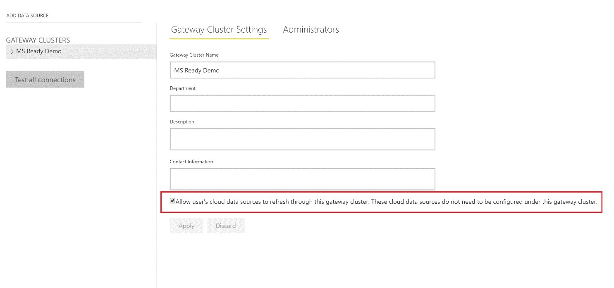
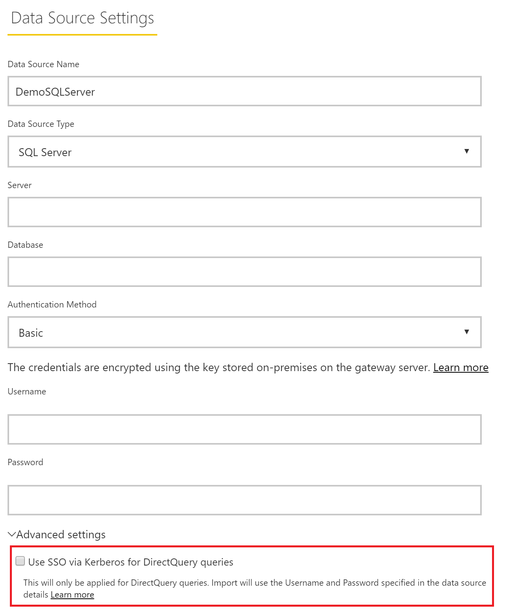

---

title: Gateway improvements
description: 
author: MargoC
manager: AnnBe
ms.date: 4/16/2018
ms.topic: article
ms.prod: 
ms.service: business-applications
ms.technology: 
ms.author: margoc
audience: Admin

---
### Gateway improvements

[!include[banner](../../includes/banner.md)]

With the on-premises data gateway, you can refresh queries that combine and
merge data from online and on-premises sources.

The enterprise gateway admin decides whether to allow the gateway to refresh
cloud data sources by using the newly added setting on the Manage Gateways page.

<!-- gateway_mashup.png -->

Setting that allows refresh of cloud source data sources

We added support for Single Sign-On that takes advantage of Kerberos when
DirectQuery mode is used to connect to the following data sources from Power BI:
SQL Server, Teradata, SAP HANA, SAP BW, (coming in April), and Impala (coming in
April).

When a user interacts with a DirectQuery report in Power BI, each cross-filter,
slice, sort, or report edit operation can cause queries to execute live against
the underlying on-premises data source. When Single Sign-On is configured for
the data source, queries execute under the identity of the user who is
interacting with Power BI (that is, through the web experience or Power BI
mobile app). Therefore, each user sees only the data they have permissions for
in the underlying data source. There is no shared data caching across different
users.

<!-- gateway_SSO.png -->

Single Sign-On Kerberos settings when adding a supported data source
