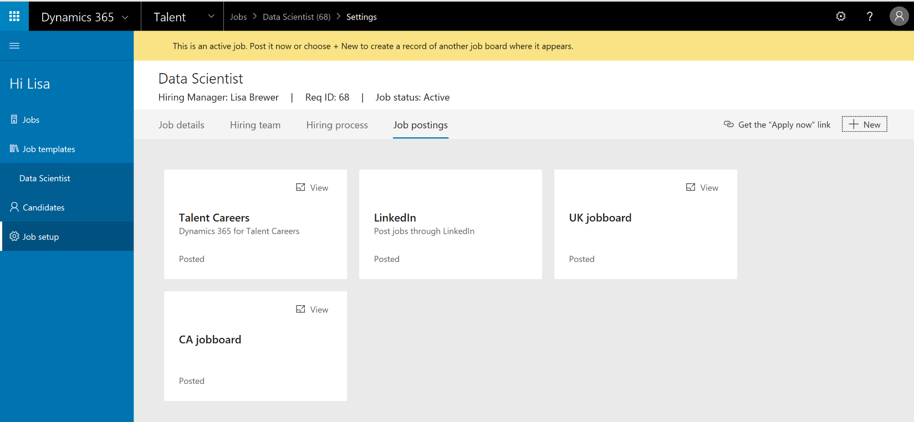
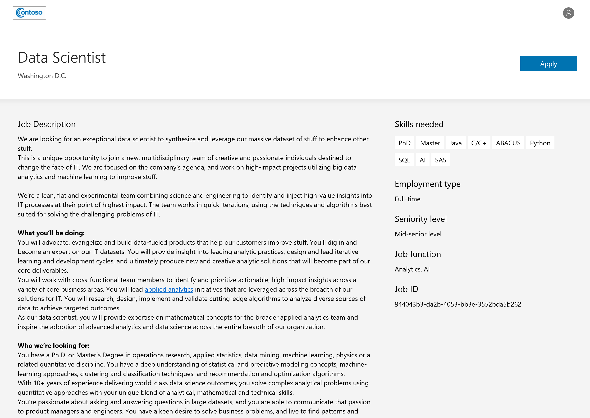

---

title: Company Career site (Public Preview)
description: 
author: MargoC
manager: AnnBe
ms.date: 4/16/2018
ms.topic: article
ms.prod: 
ms.service: business-applications
ms.technology: 
ms.author: margoc
audience: Admin

---
### Company Career site (Public Preview)

Job management lets customers automate the publication of jobs to the new Talent
Career site or use a unique URL for each job to advertise a position. New
capabilities include:

-   Talent Career site – Organizations can host open jobs on the public job
    listing site, which allows:

-   Searching for jobs, saving searches, and setting notifications of future job
    postings.

-   Displaying jobs based on internal versus external flags.

-   Recommending jobs based on candidate information.

-   Quickly posting jobs to a company career site to kick off the application
    process.

-   Publishing open positions to third-party job boards such as LinkedIn.

On the Job setup page, a hiring manager or recruiter can publish a job to the
Talent Career site or LinkedIn, and manage other postings to external job
boards, on separate tiles.

<!-- Talent_Company career site_A.PNG -->

Publishing a job to a website

<!-- Talent_Company career site_B.PNG -->

Job page on the Talent Career site
