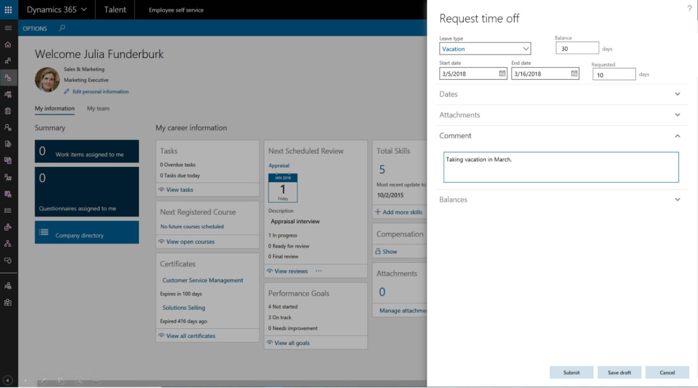

---

title: Absence management
description: 
author: MargoC
manager: AnnBe
ms.date: 4/16/2018
ms.topic: article
ms.prod: 
ms.service: business-applications
ms.technology: 
ms.author: margoc
audience: Admin

---
### Absence management

-   **“Days” support:** In many organizations, especially in European markets,
    employees submit time off in days, not hours. This change provides expanded
    capabilities to help companies ensure that they can meet compliance policies
    in European markets. Human resource administrators and managers can do
    absence tracking and approvals, while employees can submit time-off requests
    in increments of days or half-days as well as in hours.

<!-- Talent_ Absence Management - Days Support_A.png -->

Absence management days support

-   **Working day calendar:** Human resource administrators can create working
    day calendars that reflect company holidays. Working day calendars can be
    created for different types of employees and employees in different
    countries. As employees submit time-off requests, holidays are automatically
    excluded from the request, which streamlines the time-off request process.

-   **Custom absence accrual dates:** (coming after April) Enable carry-over and
    time-off accrual capabilities that are customizable to meet organization
    policies.
