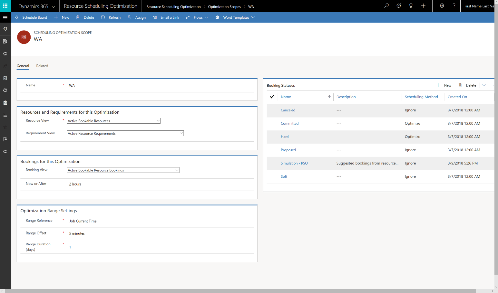

---

title: Extensible scope
description: 
author: MargoC
manager: AnnBe
ms.date: 4/13/2018
ms.topic: article
ms.prod: 
ms.service: business-applications
ms.technology: 
ms.author: margoc
audience: Admin

---
#### Extensible scope 

The Resource Scheduling Optimization solution uses scope to define the input for
resources, resource requirements, and resource bookings, as well as the
timeframes used for optimization. With extensible scope, the solution leverages
entity views in Dynamics 365 to provide an easy and flexible way to define what
gets optimized.

Scheduling optimization scope
