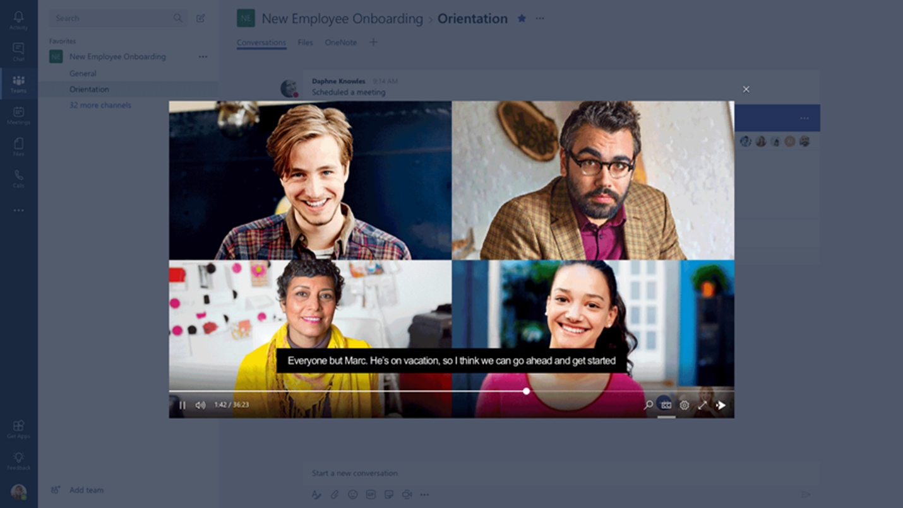

---

title: Cloud recording for meetings in Microsoft Teams
description: 
author: MargoC
manager: AnnBe
ms.date: 4/16/2018
ms.topic: article
ms.prod: 
ms.service: business-applications
ms.technology: 
ms.author: margoc
audience: Admin

---
### Cloud recording for meetings in Microsoft Teams

Microsoft Stream enables cloud recording for meetings in Microsoft Teams. Users
start recording while the meeting is going on. After the meeting, the recording
is automatically available in Microsoft Stream, with speech-to-text
transcription and people detection. The people who attended the meeting receive
permission to view the video and can watch it from within the conversation
timeline.

<!-- picture -->

Record meetings for Microsoft Teams
