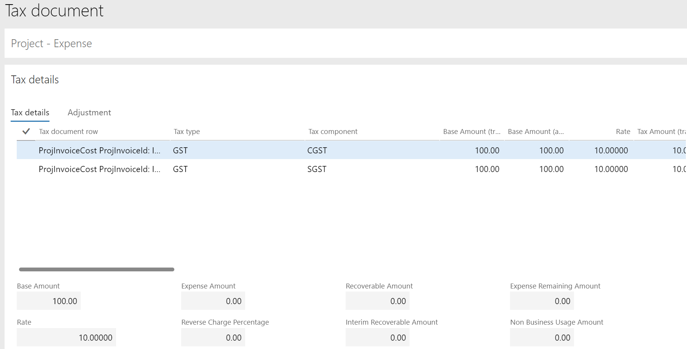

---

title: Globalization – India localization: Project and upgrade
description: 
author: MargoC
manager: AnnBe
ms.date: 4/16/2018
ms.topic: article
ms.prod: 
ms.service: business-applications
ms.technology: 
ms.author: margoc
audience: Admin

---
### Globalization – India localization: Project and upgrade

Project localization for India lets users manage India Goods and Services Tax
(GST) for the Project management and accounting module. Users can maintain India
GST information in project contracts, project categories, and so on. Users can
also calculate GST by using a configurable Global Tax Engine (GTE) for all
tax-relevant project transactions, such as project quotations, expense journals,
hour journals, item journals, fee journals, on-account transactions, project
invoice proposals, and service management. Localization upgrade for India lets
current Microsoft Dynamics AX 2012 customers upgrade to Microsoft Dynamics 365
for Finance and Operations.

<!-- FO_India_localization_project_and_upgrade_A.png -->

Project management and accounting for India

