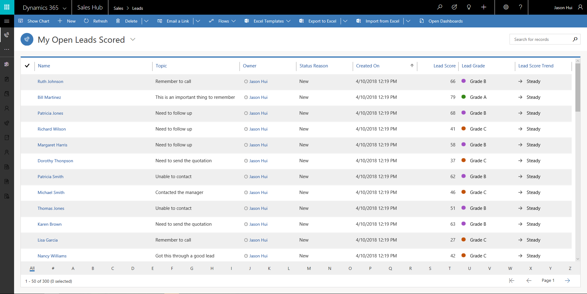
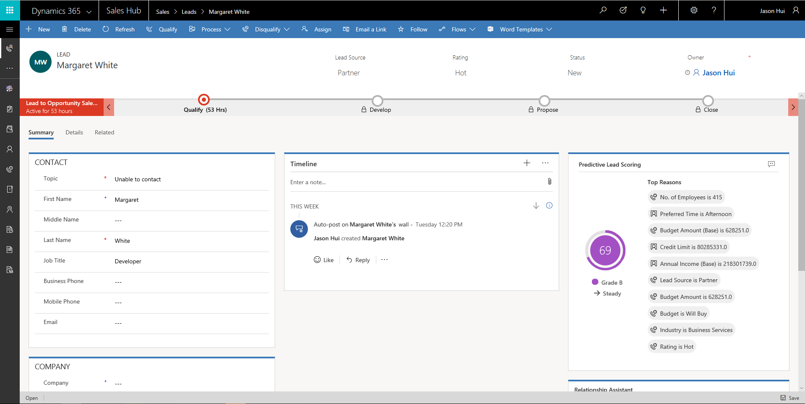
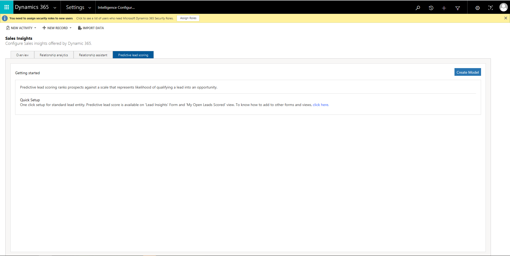
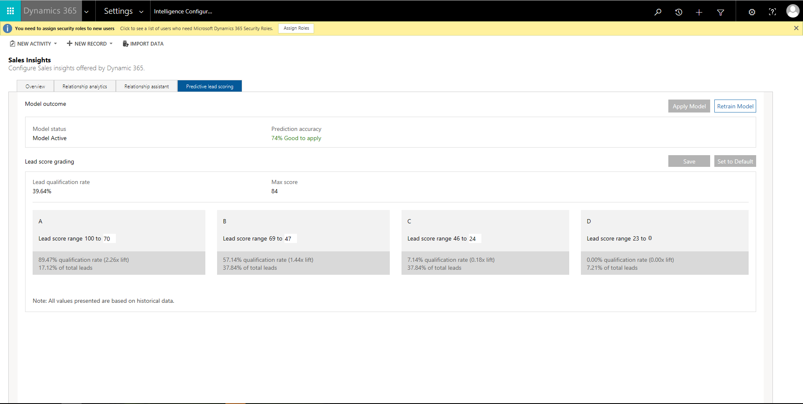

---

title: Predictive lead scoring (Public Preview)
description: 
author: MargoC
manager: AnnBe
ms.date: 4/16/2018
ms.topic: article
ms.prod: 
ms.service: business-applications
ms.technology: 
ms.author: margoc
audience: Admin

---
### Predictive lead scoring (Public Preview)

[!include[banner](../../includes/banner.md)]

Predictive lead scoring uses a predictive machine learning model to calculate a
score for all open leads. This helps salespeople to prioritize their engagement
with the leads and makes the salespeople effective by achieving higher lead
qualification rates and helps improve their productivity by reducing the time to
qualify a lead. The reasons behind the score adds transparency to the model and
helps salespeople validate the model.

Through the administration experience, a business analyst can train the model
and apply the model to existing open leads for scoring based on the prediction
accuracy. If there is more data for leads or related entities such as accounts
that will help to improve the accuracy of the model, they can retrain the model
and apply the new model. The analyst can also change the score ranges for the
grades to decide how best to prioritize for their business based on
qualification rates.

<!-- Predictive lead scoring - Grid view.png -->

*Predictive lead scoring – Grid view*

<!-- Predictive lead scoring - Score and reasons widget in form.png -->

*Predictive lead scoring – Score and reasons widget in form*

<!-- Predictive lead scoring - Configuration create model.png -->

*Predictive lead scoring – Configuration create model*

<!-- Predictive lead scoring - Configuration apply model.png -->

*Predictive lead scoring – Configuration apply model*
