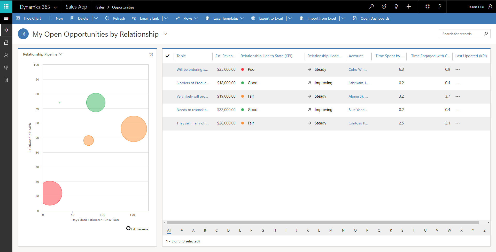
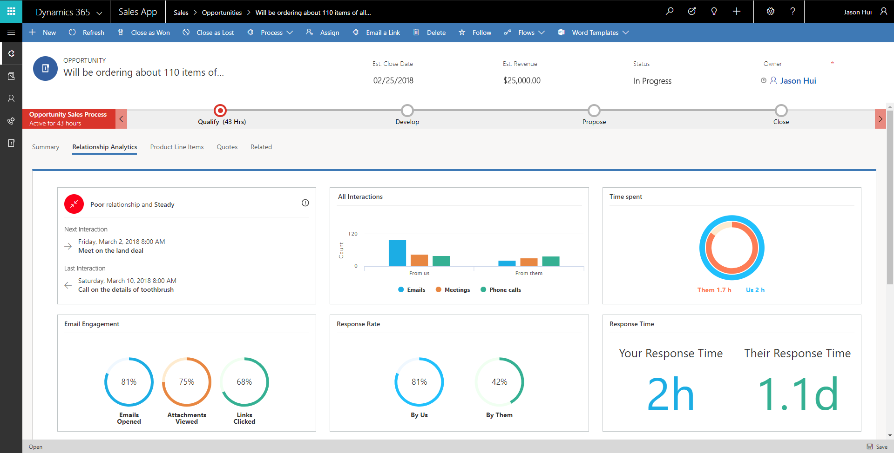
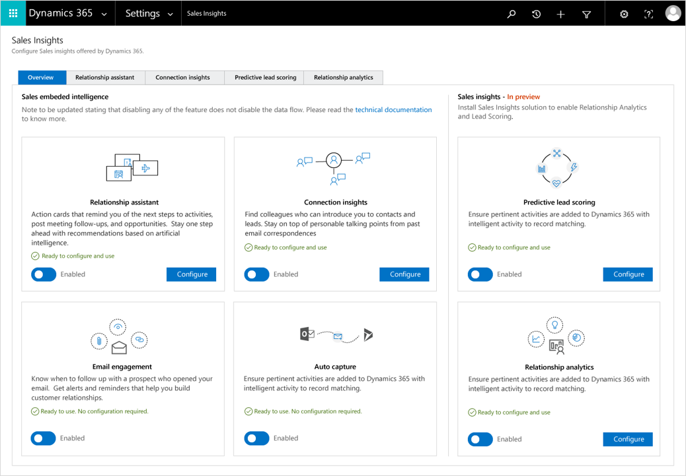

---

title: Relationship analytics (Public Preview)
description: 
author: MargoC
manager: AnnBe
ms.date: 4/16/2018
ms.topic: article
ms.prod: 
ms.service: business-applications
ms.technology: 
ms.author: margoc
audience: Admin

---
### Relationship analytics (Public Preview)

[!include[banner](../../includes/banner.md)]

**Relationship analytics** helps salespeople manage the opportunities pipeline
by analyzing relationships and presenting data and insights about the health of
customer relationships. Relationship Analytics includes **sentiment analysis**
on Microsoft Office Exchange online emails to enhance relationship health score.

<!-- Picture 5 -->

Relationship analytics overview

<!-- Picture 6 -->

Relationship analytics dashboard

<!-- Picture 4 -->

Sales insights configuration for administrators
