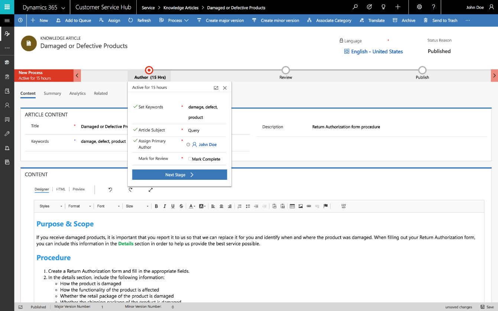
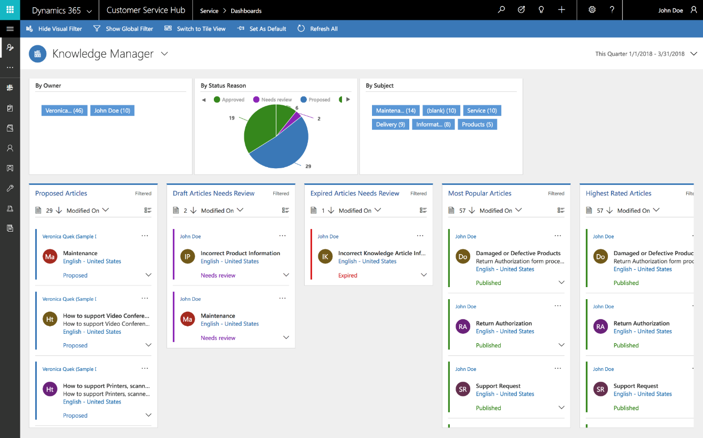

---

title: Support for authoring, searching, publishing, and translating knowledge articles
description: 
author: MargoC
manager: AnnBe
ms.date: 4/16/2018
ms.topic: article
ms.prod: 
ms.service: business-applications
ms.technology: 
ms.author: margoc
audience: Admin

---
#### Support for authoring, searching, publishing, and translating knowledge articles 

Author and edit well-formatted content for knowledge articles using a rich text
editor. The editor brings common word processor features like advanced styling,
linking, find and replace, and insert images and tables. Search, publish, and
translate knowledge articles. Preview how the knowledge articles render on
different devices before publishing.

<!-- picture -->

Knowledge article editor

Knowledge managers and authors monitor the status of knowledge articles using
interactive knowledge management dashboards.

<!-- picture -->

Knowledge manager dashboard
