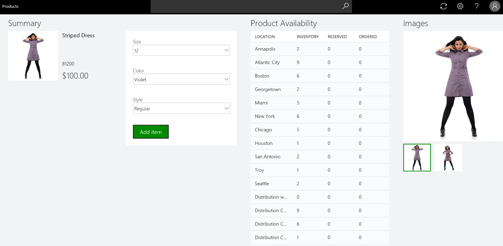

---

title: Extensibility (HQ, POS, CRT)
description: 
author: MargoC
manager: AnnBe
ms.date: 4/13/2018
ms.topic: article
ms.prod: 
ms.service: business-applications
ms.technology: 
ms.author: margoc
audience: Admin

---
### Extensibility (HQ, POS, CRT)

Most customers customize our product to support their business process. We made
major enhancements in our retail extensibility framework to simplify the
customization model, introducing a metadata and configuration-driven development
experience and more advanced APIs. This new framework reduces the lines of code
that need to be written and the time spent to do customizations. By using the
framework, business users or power users can do simple customizations without
writing any code.

We also introduced a new independent packaging model so that extensions can be
packaged separately. With the new extension framework and independent packaging
model, extensions can be created independently from the core app. They can then
be packaged and published to AppSource or the marketplace seamlessly, and then
loaded at runtime. This seamless extension model helps easily plug and unplug
any new extension, app, or extension to an existing business process model.
Extensions can also be serviced seamlessly without any change to the core app
model. With this new model, ISVs and partners can independently develop
extensions and deploy them seamlessly. POS can also load multiple extensions
independently.

We are continuously enhancing the Dev Application Lifecycle Management and the
extensibility framework to add more new extension features and APIs to simplify
the development process and reduce the effort required for servicing the
extensions.

Some new extensibility capabilities include:

-   Dev Application Lifecycle Management (ALM) – Developer tools were added to
    simplify the developer experience. Many new code samples and docs were
    published to help with development scenarios. The samples will help
    customers complete their customizations more efficiently by copying and
    pasting the code and making minor changes.

-   Packaging – With the independent extension packaging model and framework,
    customers can package extensions separately from POS, load multiple
    extensions, and plug or unplug individual extensions.

-   POS UI and API extension - We are continuously enhancing the POS framework
    to expose new POS APIs and user interface (UI) extension points, such as
    metadata-driven extensions and custom controls. With these enhancements,
    customers can modify their POS layout to add or change UI workflow or
    elements. 

-   POS overridable requests and triggers - Overridable requests were added in
    POS to override the POS workflow or POS business logic and add custom logic
    and validation. The POS triggers framework helps run custom logic before or
    after core POS logic. With this new pattern, any workflow in POS can be
    modified.

-   Search extensions – We enhanced the search framework to support searching
    any external system. Customers can modify Search by using their own custom
    fields or logic.

-   Commerce runtime (business logic layer) – With our enhanced framework,
    business logic can be added and core logic can be modified to support custom
    extension scenarios. Extensions are supported in both the business logic
    layer and the data layer.

-   Payment SDK – With the enhanced Payment SDK, any payment device or
    third-party payment provider can be integrated. 

-   Hardware station and peripherals – Enhancements in the hardware layer
    support existing device extensions, such as printers or line displays.
    Almost any new device can be integrated.

<!-- Retail_Extensibility_A.png -->

Extensibility example in Point of Sale

